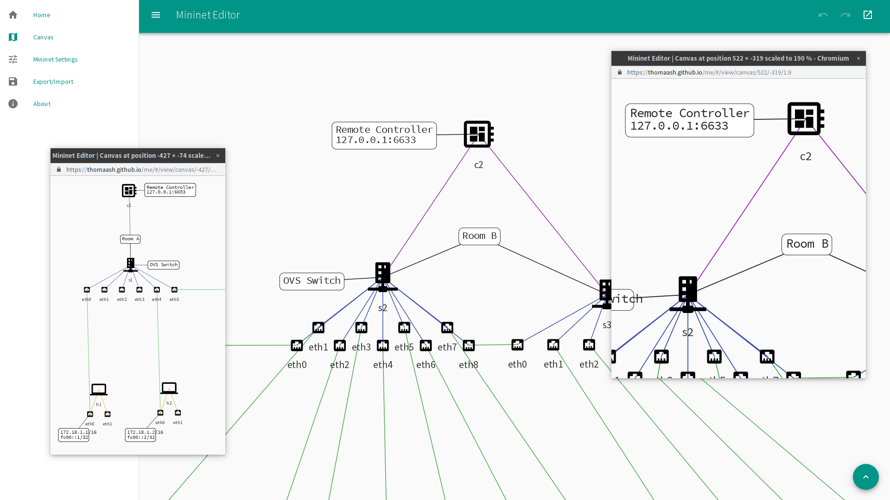
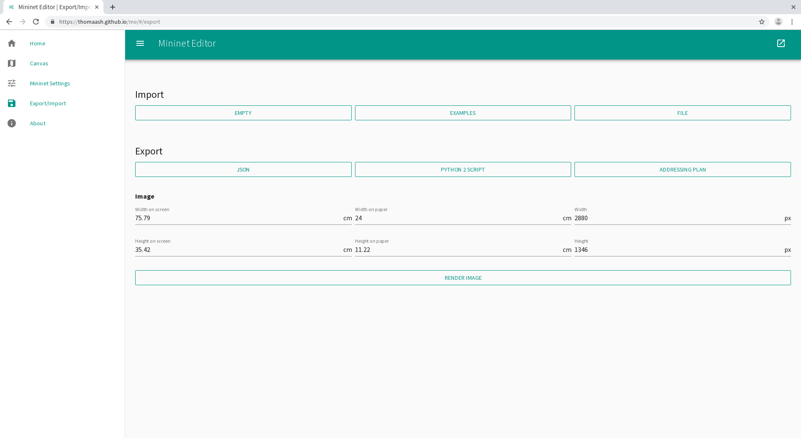
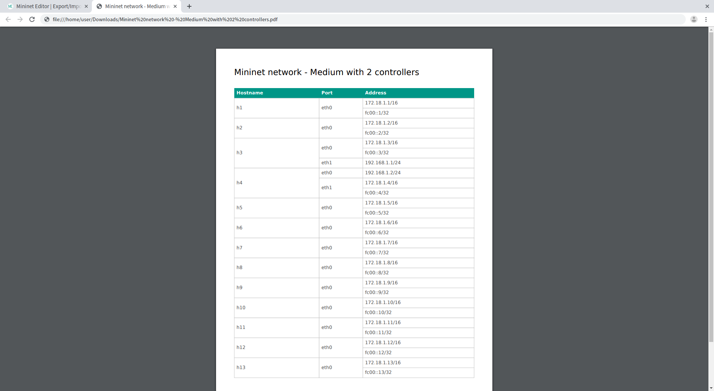

# Mininet Editor
SDN topology editor in your web browser with Mininet export.

Exports JSONs (whole projects), Python scripts (Mininet emulation), addressing plans and topology images.\
Imports JSONs and Python scripts.\
Persists projects even if the browser is closed and also works offline.

## Available online
https://www.vycital.eu/me/

## Screenshots

### Canvas

### Canvas and Views

### Export and Import

### Exported Addressing Plan

## Features
- PWA
  - Works offline once visited
  - Can be installed as native app (if the browser and operating system supports it)
- Responsive design
  - Works just fine on desktops, laptops, tablets and cell phones
  - Touch support for all essential functions
  - Mouse and keyboard is recommended for greater comfort
- Persistent
  - Close the page or crash the OS, your project won't be lost

##### Canvas
- All SDN nodes
  - Hosts
  - Switches
  - Controllers
- Traditional can be set up too
  - Switch with standalone fail mode (traditional switch)
  - Host with “sysctl -w net.ipv4.ip_forward=1” startup script (aka router)
- All Mininet settings exposed and validated
  - Feel free to open an issue if this turns out not to be true
- Startup and shutdown scripts
  - Once for Mininet
  - Once for each host
  - Once for each switch
  - Can be multiline
- Undo/redo
  - Up to 200 steps
- Labels
  - Static text
  - Placeholders with dynamic info from connected devices
    - IPs
    - Hostnames
    - Types
- Keyboard shortcuts

##### Export
- JSON
  - Contains everything (the only exception here is undo/redo history)
- Script
  - Starts Mininet emulation when invoked
- Addressing plan
  - Simple table with all ports and their IPs
  - Order
    - First hostnames alphabetically
    - Then port names alphabetically
    - IPs are left in the order they were defined
- Image
  - Whole topology as could be seen on the canvas
  - Size can be set in pixels or centimeters (screen or print variant)
  - In PNG format

##### Import
- JSON
  - Contains everything (the only exception here is undo/redo history)
- Script
  - Contains most data
  - Nodes will be placed automatically (their positions are not present in the script)
  - No labels (can't be recovered) and a few other minor things
  - Only tested for scripts generated by Mininet Editor and MiniEdit, may (probably only partially) fail for other scripts
